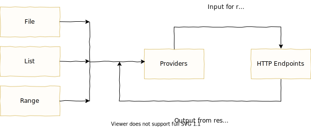

# Pewpew design overview

The primary objective of an HTTP load test is to generate traffic against web services. A user of pewpew describes what HTTP endpoints to target, any [data flows](#data-flow) and the [load patterns](#load-patterns-and-peak-loads) for the test within a YAML [config file](./config.md).

## Data flow

Some endpoints only require a simple request, relying on no other source of data. In most cases, however, endpoints require particular data as part of the request--think ids or tokens. This is where [providers](./config/providers-section.md) come in. Providers act as a [FIFO (first in, first out) queue](https://en.wikipedia.org/wiki/FIFO_(computing_and_electronics)) for sending and receiving data. A provider can be fed with data from a file, a static list, a range of numbers and/or from HTTP responses.

The data within a provider is used to build HTTP requests. Here's a diagram of how data flows:



As an example, here's a visualization of a test which hits a single endpoint on a fictitious pepper service. (Note this diagram does not reflect the structure of the YAML config file, but merely demonstrates the logical flow of data out from and back into a provider):


On the left there is a single provider defined "name" which has some predefined values. In the "endpoint definition" the top box shows a template to build a request. Because the template references the "name" provider, for every request sent a single value will be popped off the "name" provider's queue. After the response is received the "after response action" will put the previously fetched value back onto the queue. In this example the very first request would look like:

```
GET /pepper/cayenne
host: 127.0.0.1
user-agent: pewpew
```

After the response is received, the value "cayenne" would be pushed back into the "name" provider.

## Peak loads and load patterns

In most load tests it is desirable to not only generate considerable traffic but to do so in a defined pattern. Pewpew accomplishes this through the use of peak loads and load patterns. A peak load is defined for an endpoint and a load pattern can be defined test wide or on individual endpoints.

***peak load*** - how much load an endpoint should generate at "100%". Peak loads are defined in terms of "hits per minute" (HPM) or "hits per second" (HPS).

***load pattern*** - the pattern that generated traffic will follow over time. Load patterns are termed in percentages over some duration.

For example, suppose we were creating a load test against the pepper service. After some research we determine that the peak load should be 50HPM (50 hits per minute) and that the load pattern should increase from 0% (no traffic) to 50% (25HPM) over 20 minutes, remain steady for 40 minutes, then go up to 100% (50HPM) over 10 minutes and stay there for 50 minutes.

Here's what the load pattern would look like charted out over time:

